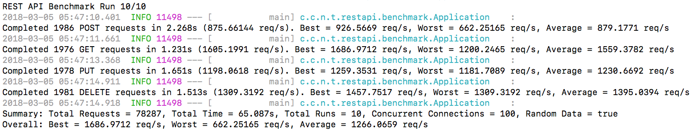

# REST API Benchmarking Tool

This Java application implements an simple benchmarking tool that measures performance of a CRUD REST API. Generates randomized data for reach request and individually tests the POST, PUT, GET, and DELETE methods of a REST API endpoint. The number of concurrent connections, requests, test runs, etc. are all configurable. For a list of options, see the [`application.properties`](src/main/resources/application.properties.blank) configuration file.

This documentation is not complete. This application is under active development.

This benchmarking tool is by default configured to test the [Back in Stock Database REST API](https://github.com/chrislzm/BackInStock/tree/master/RestApi). For more information, visit the [Back in Stock](https://github.com/chrislzm/BackInStock) project. 

Screenshot:

## Prerequisites

1. Java
2. Gradle
3. Internet connection

## Installing

1. Code each request for your API: Use the `PostNotificationJob`,  `GetNotificationJob`, `UpdateNotificationJob`, and `DeleteNotificationJob` as examples for POST, GET, PUT, and DELETE http methods respectively
2. Rename `application.properties.blank` to `application.properties` and update values (see Configuration below for additional notes)
3. Compile the application
    * Run the command `./gradlew bootRun` (will compile and run) or
    * Build an executable JAR file using `./gradlew build`, which will create a JAR file in `./build/libs/notification-service-0.1.0.jar`

### Configuration

`application.properties`
* `restapi.benchmark.notification.id.output.file`: This file will store the IDs of any objects stored to the REST API. The purpose is so that these objects can be removed from your REST API later, and so that no data currently in database is affected. To delete the data from the REST API's database, simply run a DELETE benchmark and ensure that the `restapi.benchmark.request.total` setting is greater than or equal to the number of ids in the file. The file will be updated as the objects are deleted. If the file is empty, that means that there are no objects that created by the benchmarking tool currently stored in your REST API's database.

## Deployment

For the most accurate results, use a very fast Internet connection.

Run the JAR file. If the JAR file does not execute on your system, execute the application with the command `java -jar build/libs/restapi-benchmark-0.1.0.jar`. You may need to remove the `executable = true` line from `build.gradle` and recompile the application first.

### Command Line Arguments

Please note that any or all of the settings in `application.properties` can also be overridden with command line arguments. Example: `--restapi.benchmark.request.total=1000`

## Developer Reference

This project can be easily edited in [Eclipse for Java](http://www.eclipse.org/downloads/eclipse-packages/):
1. Ensure both Gradle and Eclipse are installed
2. Download this repository to your computer
3. In Eclipse, open **File** then **Import...**
4. Under **Gradle**, select **Existing Gradle Project** and click **Next** 
5. On the **Import Gradle Project** click **Browse** and open the root directory of the project
6. Click **Finish**

### To Do
* Add/Update code documentation
* Refactor (e.g. create interfaces/abstract classes) so that it's easier to add and test other REST APIs
* Add ability to disable randomly generated data

## License

Copyright (c) 2018 [Chris Leung](https://github.com/chrislzm)

Licensed under the MIT License. You may obtain a copy of the License in the [`LICENSE`](LICENSE) file included with this project.
